  # Task Manager Calendar App
## Table of Contents

1. [Project Overview](#project-overview)
2. [Features](#features)
    - [Core Features](#core-features)
    - [User Feedback & UX](#user-feedback--ux)
    - [Admin & Security](#admin--security)
    - [Screenshots](#screenshots)
3. [Agile Planning](#agile-planning)
    - [MoSCoW Prioritisation](#moscow-prioritisation)
    - [User Stories & Epics](#user-stories--epics)
    - [Sprints](#sprints)
4. [Wireframes](#wireframes)
5. [Entity Relationship Diagram (ERD)](#entity-relationship-diagram-erd)
6. [Technologies Used](#technologies-used)
7. [Installation & Deployment](#installation--deployment)
8. [Testing](#testing)
    - [Manual Testing](#manual-testing)
    - [Automated Testing](#automated-testing)
9. [Known Bugs](#known-bugs)
10. [Credits & Acknowledgements](#credits--acknowledgements)

## Project Overview

The Task Manager Calendar App is a full-stack productivity tool that allows users to create, organize, and track tasks with due dates, priorities, and categories. It is designed to help users stay organized and focused, offering a clean user interface and dynamic task status tracking (Open → In Progress → Done).

Each user has their own private task list and can:

- Register or log in to their account
- Create new tasks with custom attributes (e.g., due date, priority)
- Edit or delete tasks
- Automatically mark tasks as "overdue" if the due date has passed
- Move tasks between status stages (Open, In Progress, Done)

The application uses Django REST Framework on the backend and React on the frontend. It is fully responsive and accessible on both desktop and mobile devices.

This project was built as the Portfolio Project 5: Full-Stack Toolkit for the Code Institute diploma, demonstrating skills in Agile methodology, API development, user authentication, data handling, and deployment to a live platform.

## Features

### Core Features

- **User Authentication**
  - Register and log in securely
  - Token-based authentication with protected routes
  - Users can only see and manage their own tasks

- **Task Management**
  - Create new tasks with a title, description, due date, priority, and category
  - Edit or delete existing tasks
  - Real-time task status switching (Open → In Progress → Done)
  - Tasks are automatically marked as “Overdue” if the due date has passed and the task is not done

- **Task Display**
  - Filtered by status: Open, In Progress, Done
  - Clearly styled task cards with badges for priority, status, and overdue
  - Confirmation modal before deleting a task

### User Feedback & UX

- **Form Validation**
  - Prevent empty task titles and past due dates
  - Friendly toast messages for form errors and success

- **Visual Design**
  - Fully responsive on all screen sizes
  - Modern layout using card components and badges
  - Color-coded status and priority indicators for easy scanning

- **Navigation**
  - Clean navbar with route-based navigation
  - Back buttons and confirmation modals improve usability

### Admin & Security

- **Backend Security**
  - DRF permission classes restrict access to authenticated users only
  - Environment variables securely manage sensitive credentials

- **Deployment**
  - Fully deployed on Render (backend and frontend)
  - Uses PostgreSQL in production and SQLite locally

## Screenshots

### 1. Home Page
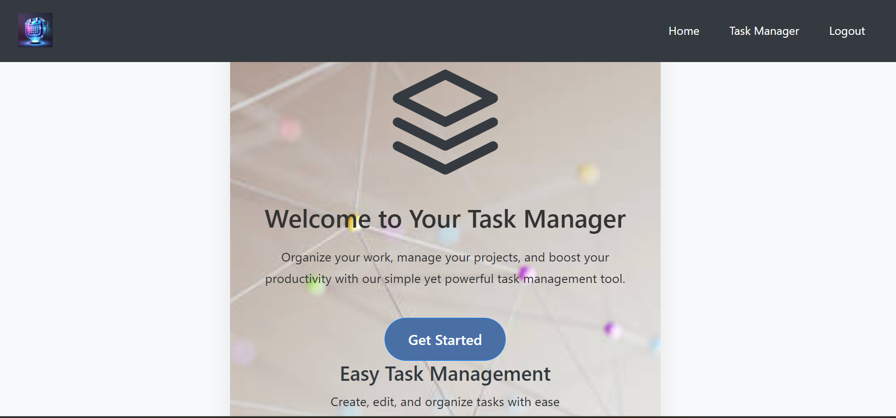

### 2. Login Page

### 3. Register Page
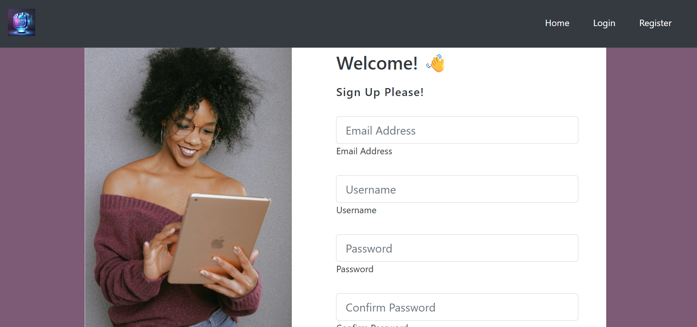

### 4. Task Dashboard – Open Tasks
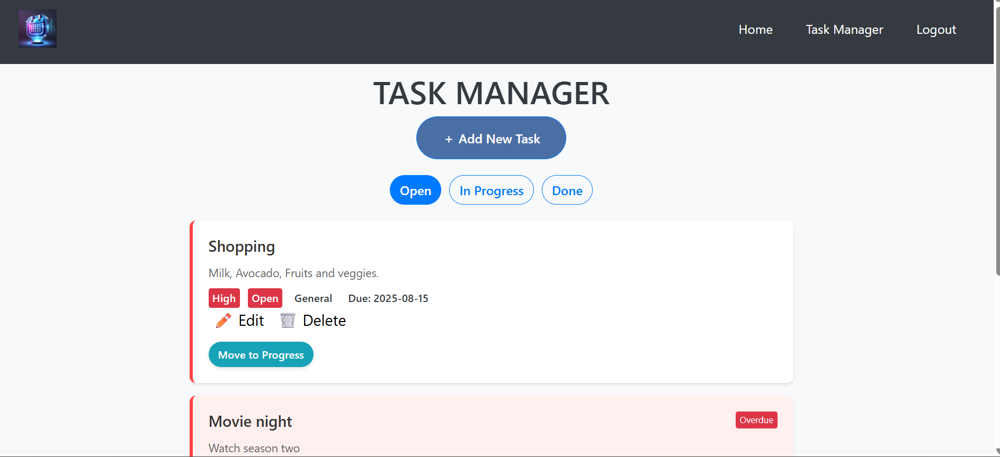

### 5. Task Dashboard – In Progress Tasks
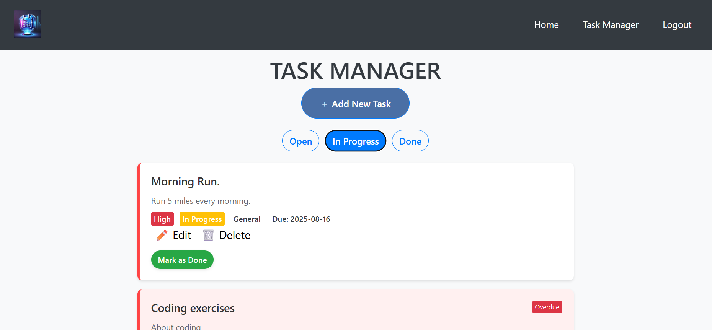

### 6. Task Dashboard – Done Tasks
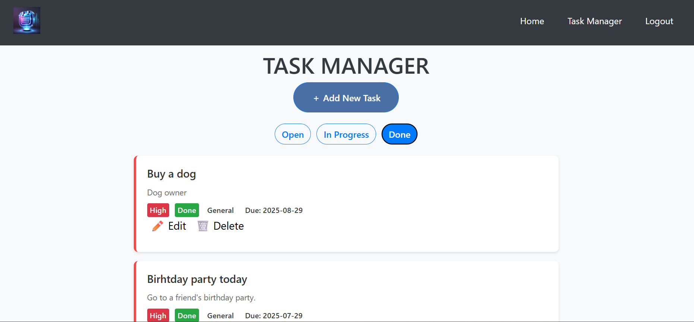

### 7. Add New Task Modal
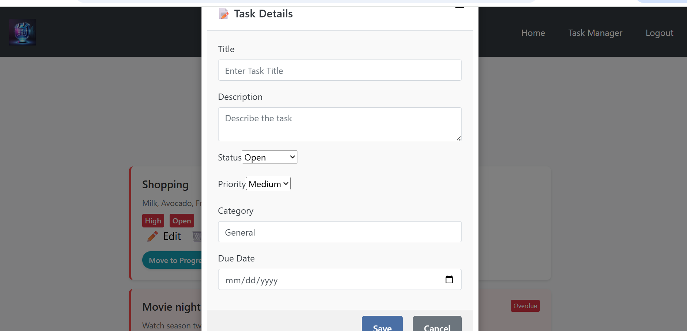

### 8. Edit Task Modal
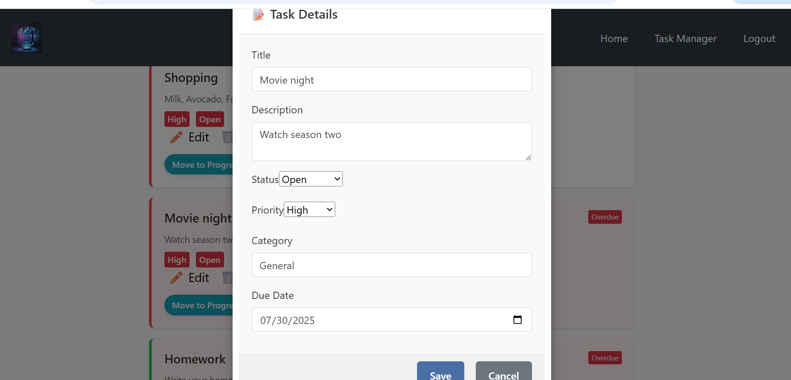

### 9. Delete Task Modal
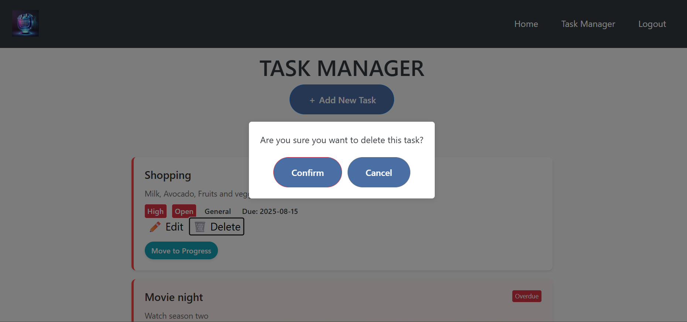

### 10. Admin Page
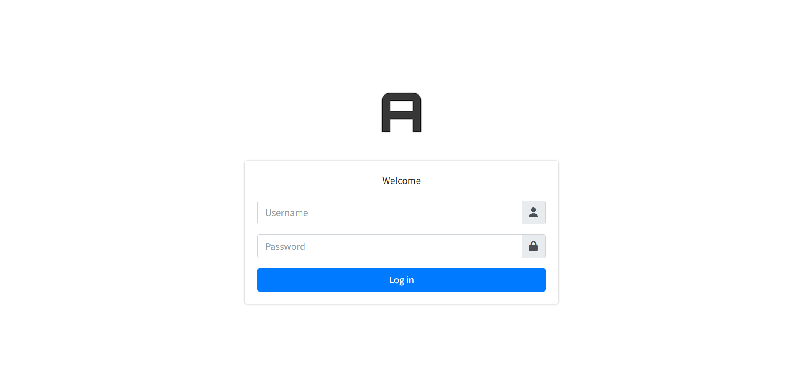

## Agile Planning

This project was planned and managed using GitHub Issues, a Project Board, and MoSCoW prioritisation.

### MoSCoW Prioritisation

All tasks were assigned one of the following priority labels:
### MoSCoW Prioritisation

- 🟥 **Must-Have**
  - User registration and login
  - Token-based authentication
  - Task creation and display
  - Task editing and deletion
  - Status-based task filtering
  - User-specific task access

- 🟨 **Should-Have**
  - Task priorities and categories
  - Overdue task detection
  - Task status buttons (Open → In Progress → Done)
  - Delete confirmation modal
  - Edit modal pre-filling

- 🟩 **Could-Have**
  - Toast notifications
  - Basic form validation (title, due date)
  - Responsive design for all screen sizes
  - SEO tags using `react-helmet-async`
  - Visual styling (colors, badges)

- ⚪️ **Won’t-Have**
  - Calendar UI
  - Multi-user task assignment
  - Task comments/attachments
  - Push/email notifications
  - Admin reporting tools

You can view the live MoSCoW-labeled issue board here:  
🔗 [GitHub Issues with MoSCoW Labels](https://github.com/laminsaidy/frontend/issues)

### User Stories & Epics

User stories were grouped into high-level Epics to guide feature development:

- 🧩 **Epic: User Authentication**
  - Register and login forms
  - Token handling and private route protection

- 🧩 **Epic: Task Management**
  - Create, update, delete tasks
  - Set due dates, priorities, categories
  - Status logic: Open → In Progress → Done
  - Overdue detection

- 🧩 **Epic: UI & UX**
  - Responsive layout
  - Toast notifications
  - Tabbed filtering and color indicators

- 🧩 **Epic: Agile & Deployment**
  - Environment variable setup
  - README and testing documentation
  - Live deployment on Render

Each story included acceptance criteria and was linked to the appropriate Epic.

### Sprints

Development was split into two main sprints:

- **Sprint 1**
  - Set up backend with Django & DRF
  - Create models and authentication system
  - Build basic React structure and login flow

- **Sprint 2**
  - Implement task features (CRUD, filtering, overdue logic)
  - Style the app with status-based views
  - Add validation, toasts, and final deployment

## Wireframes

The following wireframe sketches were created during the planning phase to visualize the structure and user flow of the Task Manager Calendar App.

| **Wireframe**         | **Description**                                                                 |
|------------------------|---------------------------------------------------------------------------------|
| **Login/Register**     | Basic form layout for user authentication (top-left sketch).                   |
| **Task Dashboard**     | Kanban-style board showing task status columns (top-right sketch).             |
| **Add/Edit Task Modal**| Popup form for creating or editing task details (bottom-left sketch).          |
| **Task Details/Delete**| Modal or confirmation prompt for task actions (bottom-right sketch).           |

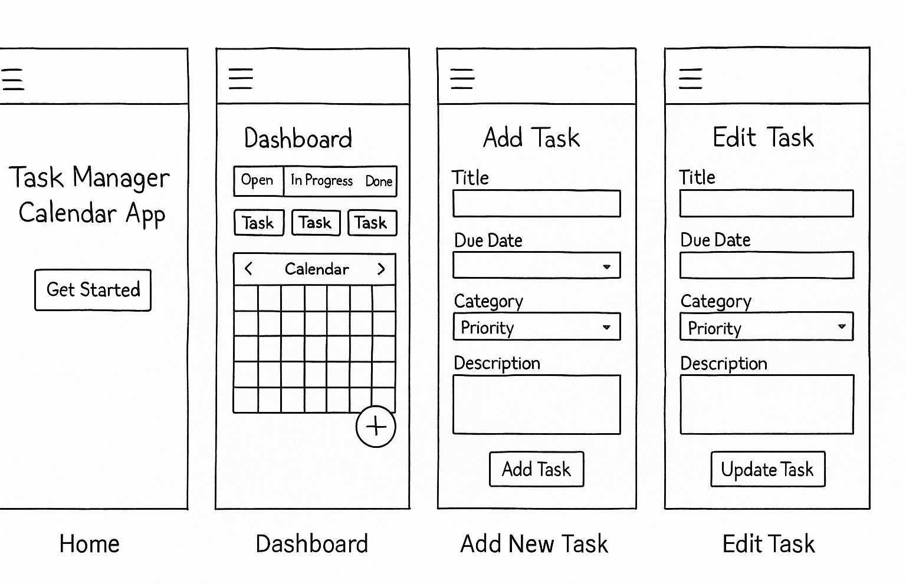

## Entity Relationship Diagram (ERD)

The diagram below illustrates the relationship between users and their tasks. Each user can create multiple tasks, but each task belongs to one specific user.

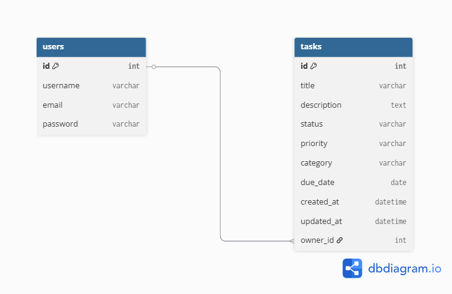

The database consists of two main tables:

### `users` (Django built-in)
- `id` – Primary key
- `username`
- `email`
- `password` (hashed)

### `tasks` (custom model)
- `id` – Primary key
- `title`
- `description`
- `status` (Open, In Progress, Done)
- `priority` (Low, Medium, High)
- `category`
- `due_date`
- `created_at`
- `updated_at`
- `owner_id` – ForeignKey to `users(id)`

## Technologies Used

### Languages

- [Python](https://www.python.org/)
- [JavaScript](https://developer.mozilla.org/en-US/docs/Web/JavaScript)
- [HTML5](https://developer.mozilla.org/en-US/docs/Web/Guide/HTML/HTML5)
- [CSS3](https://developer.mozilla.org/en-US/docs/Web/CSS)

### Frameworks, Libraries, and Tools

#### Backend

- [Django](https://www.djangoproject.com/) – Python web framework
- [Django REST Framework](https://www.django-rest-framework.org/) – API framework
- [PostgreSQL](https://www.postgresql.org/) – Production database
- [SQLite](https://www.sqlite.org/index.html) – Local development DB

#### Frontend

- [React](https://reactjs.org/) – JavaScript UI library
- [React Router DOM](https://reactrouter.com/) – Routing and navigation
- [Axios](https://axios-http.com/) – HTTP client for API calls
- [React Helmet Async](https://github.com/staylor/react-helmet-async) – SEO/meta tags
- [SweetAlert2](https://sweetalert2.github.io/) – Toast and popup alerts

#### Version Control & Deployment

- [Git](https://git-scm.com/) – Version control
- [GitHub](https://github.com/) – Repository hosting
- [Render](https://render.com/) – Backend & frontend cloud deployment

#### Other Tools

- [VS Code](https://code.visualstudio.com/) – Code editor
- [dbdiagram.io](https://dbdiagram.io/) – ERD diagram generation
- [draw.io](https://app.diagrams.net/) – Optional diagram tool

## Installation & Deployment

### Local Installation

| Step | Description |
|------|-------------|
| 1️⃣ | **Clone the repositories** `git clone https://github.com/laminsaidy/frontend.git` `git clone https://github.com/laminsaidy/backend-api-calender.git` |
| 2️⃣ | **Backend Setup** Navigate into the backend directory: `cd backend-api-calender`  Create a virtual environment and activate it: `python -m venv venv` `source venv/bin/activate`   *(Windows: `venv\Scripts\activate`)*  Install dependencies: `pip install -r requirements.txt`  Create a `.env` file with your environment variables *(SECRET_KEY, DATABASE_URL, DEBUG, etc.)*  Run migrations and start the server: `python manage.py migrate` `python manage.py runserver` |
| 3️⃣ | **Frontend Setup** Navigate into the frontend directory: `cd ../frontend`  Install dependencies: `npm install`  Create a `.env` file and set your backend API base URL: `REACT_APP_API_URL=http://localhost:8000`  Start the frontend app: `npm start` |

### Deployment (Live App)

| Platform | Description |
|----------|-------------|
| 🔗 **Frontend** | Deployed using **Render**:  👉 [https://frontend-calendar-2rcv.onrender.com](https://frontend-calendar-2rcv.onrender.com) |
| 🔗 **Backend API** | Deployed using **Render**:  👉  [https://backend-render-api-calender.onrender.com](https://backend-render-api-calender.onrender.com) |

###  Deployment Notes

- Environment variables are securely stored in **Render → Environment tab**
- `DEBUG = False` is used in production mode
- **PostgreSQL** is used in production (Render auto-provisioned)
- Static files are handled using **WhiteNoise**

## Testing
All core features were thoroughly tested to ensure functionality, responsiveness, and reliability. Testing was conducted through a combination of manual and automated methods, with documented evidence and validation tools.

### Manual Testing

All features were manually tested across the latest versions of Chrome, Firefox, and Edge on both desktop and mobile screen sizes.

#### ✅ Functional Testing

| Feature                        | Test Performed                                                               |Result|
|-------------------------------|-------------------------------------------------------------------------------|------|
| User Registration             | Registered new user with valid and invalid credentials                        | ✅   |
| User Login                    | Logged in with correct and incorrect passwords                                | ✅   |
| Token Authenticated API Calls | Tried accessing `/api/tasks/` with and without login                          | ✅   |
| Create Task                   | Added a task with all required fields                                         | ✅   |
| Prevent Empty Title           | Tried submitting task form without a title                                    | ✅   |
| Prevent Past Due Date         | Tried adding a task with a due date before today                              | ✅   |
| Edit Task                     | Modified a task, saved changes, and confirmed update                          | ✅   |
| Delete Task                   | Deleted a task after confirmation dialog                                      | ✅   |
| Overdue Task Detection        | Verified task is marked overdue when due date has passed                      | ✅   |
| Status Switching              | Moved tasks between Open → In Progress → Done and confirmed update visually   | ✅   |
| Toast Notifications           | Saw toast messages for success/failure actions                                | ✅   |
| Mobile Responsiveness         | Checked layout on Chrome dev tools (iPhone 12, Pixel 5, Galaxy S)             | ✅   |
| Page Titles & Meta Tags       | Confirmed correct meta title on each route using `react-helmet-async`         | ✅   |

---

### Manual Validation Tools Used

#### 🔹 CSS Validation

- [W3C CSS Validator](https://jigsaw.w3.org/css-validator/)
- Tested all custom stylesheets

📸 Screenshot proof:  

### 1. Index.css

### 2. Theme.css
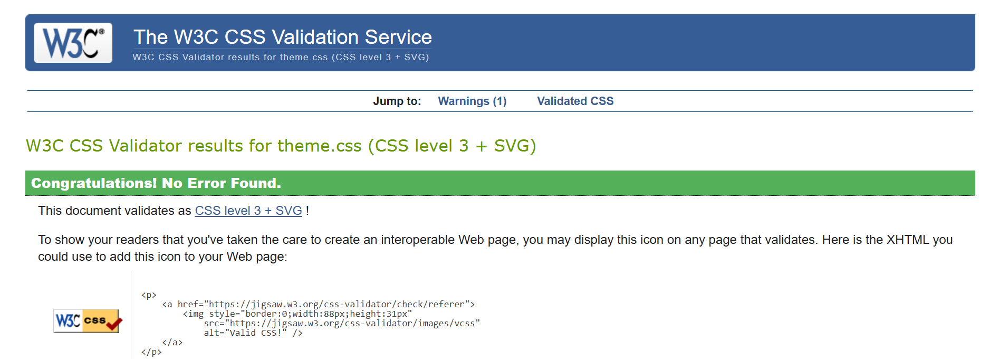

### 3. Taskmanager.css
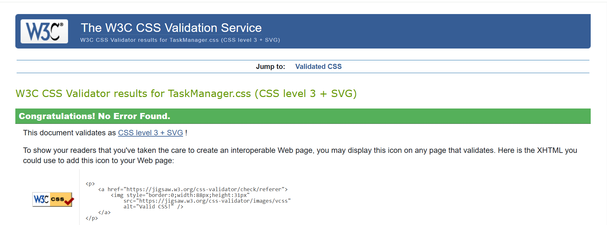

### 4. Taskdetail.css

---

### Automated Testing

#### Django (Backend)

Automated tests are included in `backend-api-calender/tasks/tests.py` and test the following:

- Creating a task via the API
- Editing a task
- Deleting a task
- Authentication required to access tasks

Run tests using:
python manage.py test

📸 Screenshot proof:  

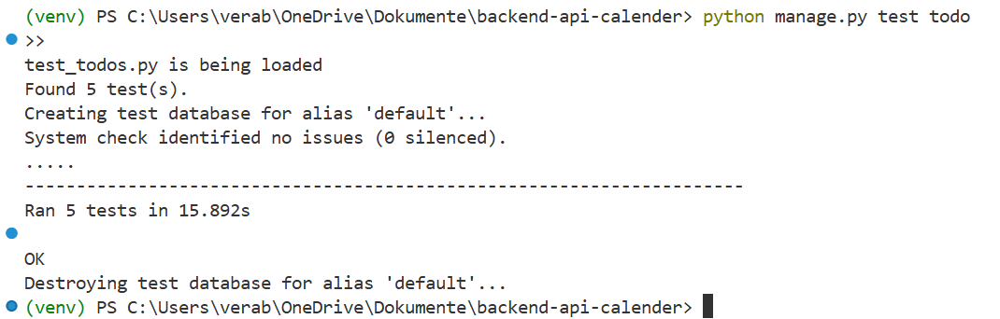

🧪 Additional Notes
- Frontend testing with React Testing Library was considered but not implemented due to time constraints. Manual UI testing was prioritized to ensure full coverage of all user flows.

- The backend test coverage focuses on authenticated API usage and CRUD functionality.

## Known Bugs

The following issues were noticed during development and where fixed:

- Tasks do not automatically refresh after editing or deleting (manual reload required)
- No toast message appears when login fails
- Task title input allows whitespace-only entries (should be prevented)
- Task modal sometimes briefly shows empty fields on slow connections
- Toasts may appear with slight delay on very slow networks

## Credits & Acknowledgements

### 🔧 Tools & Frameworks

- [React](https://reactjs.org/) — Frontend library
- [Django REST Framework](https://www.django-rest-framework.org/) — Backend API
- [React Router](https://reactrouter.com/) — Client-side routing
- [SweetAlert2](https://sweetalert2.github.io/) — Toasts and modals
- [React Helmet Async](https://github.com/staylor/react-helmet-async) — SEO & meta tags
- [Bootstrap](https://getbootstrap.com/) — CSS framework (for styling adjustments)
- [Render](https://render.com/) — Cloud deployment platform

---

### 🧑‍🏫 Educational Resources

- [Code Institute](https://codeinstitute.net/) — Full-Stack Toolkit course
- Code Institute's walkthrough projects (Blog, Moments)
- YouTube tutorials, GitHub snippets, and Stack Overflow answers

---

### 🙏 Special Thanks

- **My mentor and tutors** at Code Institute for guidance
- My friend Pedram who is a React Senior developer
- Fellow students and the community on the Slack channels
- Reviewers and assessors for constructive feedback

---

### 📝 Note on Attribution

All external libraries and resources used have been credited. All images, icons, 
and assets are either open source, created by me, or generated with permission.

